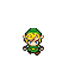
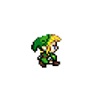
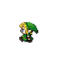
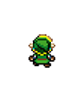
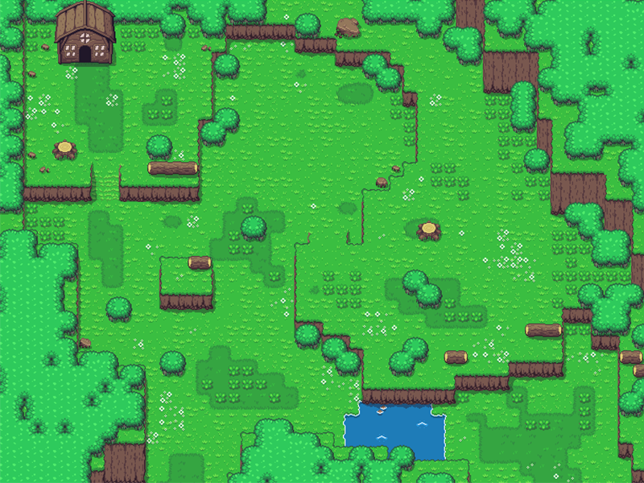

# Primeiro jogo em Python

## Algumas informações e demonstrações a seguir

O jogo é baseado no jogo Zelda Minish Cap.
No entanto meus conhecimentos ainda são poucos neste momento em que comecei, mas irei atualizando sempre que aprender algo novo.

## Imagens

### Personagem:

### Mapa:

## Código

> Foi usado a linguagem Python junto com a biblioteca pygame.

~~~~python
import pygame

from pygame.locals import *
~~~~
### Aqui os comandos usados para a movimentação do personagem
~~~~python
if comandos[pygame.K_UP] or comandos[pygame.K_w]:
    if y > -25:
        if comandos[pygame.K_w] and comandos[pygame.K_LCTRL] or comandos[pygame.K_UP] and comandos[pygame.K_LCTRL]:
            y -= velocidade + boost
        else:
            y -= velocidade
    
    if tempo == tempoAndar:
        if sprite == 0:
            sprite += 1
        else:
            sprite -= 1
    if tempo == tempoAndar:
        tempo -= tempoAndar
    else:
        tempo += 1
    
    direcao = cima[sprite]
    
        
elif comandos[pygame.K_DOWN] or comandos[pygame.K_s]:
    if y < 515:
        if comandos[pygame.K_s] and comandos[pygame.K_LCTRL] or comandos[pygame.K_DOWN] and comandos[pygame.K_LCTRL]:
            y += velocidade + boost
        else:
            y += velocidade
    
    direcao = baixo
    
    
elif comandos[pygame.K_RIGHT] or comandos[pygame.K_d]:
    if x < 690 or x < 710 and y > 505:
        if comandos[pygame.K_d] and comandos[pygame.K_LCTRL] or comandos[pygame.K_RIGHT] and comandos[pygame.K_LCTRL]:
            x += velocidade + boost
        else:
            x += velocidade
    
    if tempo == tempoAndar:
        if sprite == 0:
            sprite += 1
        else:
            sprite -= 1
    if tempo == tempoAndar:
        tempo -= tempoAndar
    else:
        tempo += 1
        
    direcao = direita[sprite]
    
    
elif comandos[pygame.K_LEFT] or comandos[pygame.K_a]:
    if x > 5:
        if comandos[pygame.K_a] and comandos[pygame.K_LCTRL] or comandos[pygame.K_LEFT] and comandos[pygame.K_LCTRL]:
            x -= velocidade + boost
        else:
            x -= velocidade
    
    if tempo == tempoAndar:
        if sprite == 0:
            sprite += 1
        else:
            sprite -= 1
    
    if tempo == tempoAndar:
        tempo -= tempoAndar
    else:
        tempo += 1
        
    direcao = esquerda[sprite]
~~~~

[Código Completo do Jogo](jogo_parte1.py)

No momento atual é isto.
Até a próxima!
